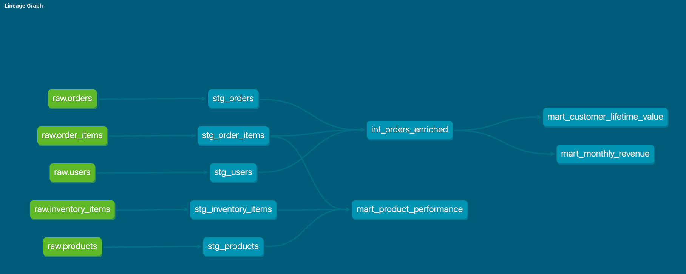

# dbt + BigQuery E-Commerce Analytics Pipeline

> End-to-end ELT pipeline built with dbt Core and Google BigQuery — transforming 100k+ e-commerce records through a 3-layer medallion architecture, fully within the GCP free tier.

---

## Project overview

This project demonstrates a production-style data engineering workflow: raw e-commerce data flows through dbt-managed transformations into analytics-ready mart tables, exposed via a Looker Studio dashboard.

**What this project covers:**
- dbt staging, intermediate, and gold mart models with full column-level documentation
- BigQuery-specific optimisations: partitioning by date, clustering by `user_id`, incremental models using MERGE
- 40+ data quality tests using dbt built-in tests, dbt-utils, and dbt-expectations
- Looker Studio dashboard with 4 business metrics charts

---

## Architecture

```
┌────────────────────────────────────────────────────────────────-─┐
│                        Google Cloud Platform                     │
│                                                                  │
│  ┌─────────────────-─┐     ┌────────────────────────────────┐    │
│  │  BigQuery Public  │     │         dbt Core (local)       │    │
│  │     Dataset       │────▶│  stg_* → int_* → mart_*        │    │
│  │  thelook_ecommerce│     └──────────────┬─────────────────┘    │
│  └─────────────────-─┘                    │                      │
│                                           ▼                      │
│              ┌───────────────────────────────────┐               │
│              │           BigQuery Datasets       │               │
│              │  raw  │  staging  │    marts      │               │
│              └───────────────────────────────────┘               │
│                                          │                       │
│                                          ▼                       │
│              ┌───────────────────────────────────┐               │
│              │         Looker Studio             │               │
│              │   Revenue │ Products │ LTV │ OTD  │               │
│              └───────────────────────────────────┘               │
└────────────────────────────────────────────────────────────────-─┘
```

**Stack:** dbt Core · Google BigQuery · Looker Studio · GitHub Actions (optional CI)

---

## Dataset

**Source:** [`bigquery-public-data.thelook_ecommerce`](https://console.cloud.google.com/marketplace/product/bigquery-public-data/thelook-ecommerce)

A synthetic e-commerce dataset maintained by Google, available as a native BigQuery public dataset — no upload required.

| Table             | Description                               | Approx. rows  |
|-------------------|-------------------------------------------|---------------|
| `orders`          | Order headers with status and timestamps  | 125k+         |
| `order_items`     | Line-item detail per order                | 250k+         |
| `users`           | Customer demographics                     | 100k+         |
| `products`        | Product catalogue with category and cost  | 29k+          |
| `inventory_items` | Stock and cost data                       | 490k+         |

---

## dbt project structure

```
dbt_project/
├── models/
│   ├── staging/
│   │   ├── sources.yml                  # thelook_ecommerce source definition
│   │   ├── schema.yml                   # staging-layer tests & descriptions
│   │   ├── stg_orders.sql
│   │   ├── stg_users.sql
│   │   ├── stg_order_items.sql
│   │   └── stg_products.sql
│   ├── intermediate/
│   │   └── int_orders_enriched.sql      # orders + users + items joined
│   └── marts/
│       ├── schema.yml                   # mart-layer tests & descriptions
│       ├── mart_customer_lifetime_value.sql
│       ├── mart_product_performance.sql
│       └── mart_monthly_revenue.sql     # incremental, partitioned, clustered
├── macros/
│   └── safe_divide.sql                  # wraps BigQuery SAFE_DIVIDE
├── packages.yml                         # dbt-utils, dbt-expectations
├── dbt_project.yml
└── docs/
    └── dbt_dag.png                      # lineage screenshot
```

### Materialisation strategy

| Layer        | Materialisation | Notes                                    |
|--------------|-----------------|------------------------------------------|
| Staging      | `view`          | Lightweight — no storage cost            |
| Intermediate | `view`          | Ephemeral joins, not persisted           |
| Marts        | `table`         | Columnar storage, fast analytical reads  |

### BigQuery optimisations (mart layer)

```sql
{{ config(
    materialized='incremental',
    unique_key='month',
    partition_by={'field': 'created_at', 'data_type': 'date'},
    cluster_by=['user_id']
) }}
```

Partition pruning + clustering reduces bytes scanned, keeping queries within the 1 TB/month free tier.

---

## dbt lineage (DAG)



*Raw sources → staging views → intermediate enrichment → gold mart tables*

---

## Looker Studio dashboard

**[View live dashboard →](#)** *(https://datastudio.google.com/reporting/6f6d89bc-f6b6-4661-94d8-d9d71ee71706)*

| Chart                      | Source table                     | Chart type                |
|----------------------------|----------------------------------|---------------------------|
| Monthly revenue trend      | `mart_monthly_revenue`           | Time series               |
| Top 10 products by revenue | `mart_product_performance`       | Horizontal bar            |
| Customer LTV distribution  | `mart_customer_lifetime_value`   | Bucketed bar              |
| On-time delivery rate      | `mart_monthly_revenue`           | Scorecard / time series   |

---

## Setup instructions

### Prerequisites

- Python 3.9+
- A Google Cloud account (free tier is sufficient)
- A GCP project with the BigQuery API enabled

### 1. Clone the repo

```bash
git https://github.com/pksv/dbt-bigquery-orders.git
```

### 2. Install dependencies

```bash
pip install dbt-bigquery dbt-utils
```

### 3. Configure dbt profile

Create or update `~/.dbt/profiles.yml`:

```yaml
my_project:
  target: dev
  outputs:
    dev:
      type: bigquery
      method: oauth
      project: your-gcp-project-id
      dataset: staging
      location: US
      threads: 4
```

### 4. Create BigQuery datasets

In the BigQuery console, create three datasets in your project:
- `raw`
- `staging`
- `marts`

Use the same region you set in `profiles.yml`.

### 5. Run dbt

```bash
dbt debug          # verify connection
dbt deps           # install packages
dbt run            # build all models
dbt test           # run data quality tests
dbt docs generate  # build documentation
dbt docs serve     # open docs at localhost:8080
```

---

## Key technical highlights

- **BigQuery-native SQL**: `DATE_TRUNC`, `DATE_DIFF`, `APPROX_COUNT_DISTINCT`, `SAFE_DIVIDE`, `PARSE_TIMESTAMP`
- **Incremental models**: `MERGE` statement for efficient monthly revenue updates
- **Partitioning & clustering**: reduces bytes scanned on time-series mart queries
- **dbt packages**: `dbt-utils` for cross-database macros; `dbt-expectations` for data quality assertions
- **Custom macro**: `safe_divide(numerator, denominator)` wrapping BigQuery's `SAFE_DIVIDE`
- **Source freshness**: `dbt source freshness` configured on `thelook_ecommerce`